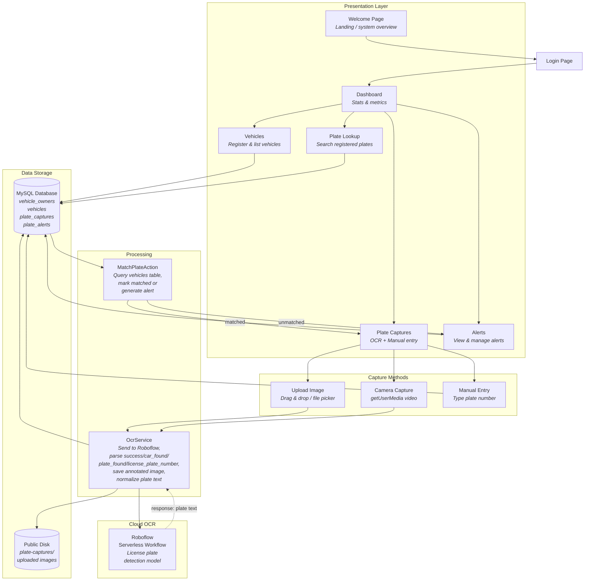
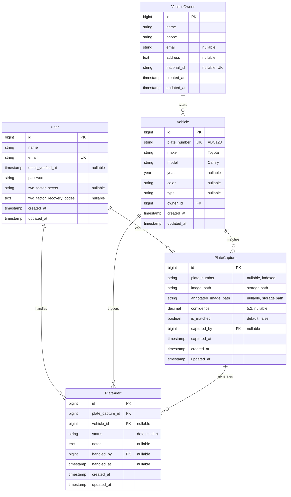

# Taxify — Vehicle Plate Number Recognition System

A Laravel-powered law enforcement application for license plate recognition (LPR), vehicle registration management, and automated alerting. Built with Livewire 4, Flux UI, Tailwind CSS v4, and Roboflow serverless OCR.

## Architecture



## Data Model

### Entity-Relationship Diagram



### Relationship Notes

| Relationship | Foreign Key | Match |
|---|---|---|
| `User → PlateCapture` | `plate_captures.captured_by` | `users.id` |
| `User → PlateAlert` | `plate_alerts.handled_by` | `users.id` |
| `VehicleOwner → Vehicle` | `vehicles.owner_id` | `vehicle_owners.id` |
| `Vehicle → PlateCapture` | `plate_captures.plate_number` | `vehicles.plate_number` |
| `Vehicle → PlateAlert` | `plate_alerts.vehicle_id` | `vehicles.id` |
| `PlateCapture → PlateAlert` | `plate_alerts.plate_capture_id` | `plate_captures.id` |

The `PlateCapture ↔ Vehicle` relationship uses `plate_number` as the loose join key (varchar match), not a foreign key constraint.

## Processing Flow

### Step-by-Step

```mermaid
flowchart LR
    S([Start]) --> A{Method?}
    A -->|OCR| B[Upload / Camera]
    A -->|Manual| C[Type plate]

    B --> D[OcrService.recognize]
    D --> D1[Store image to disk]
    D1 --> D2[Base64 encode]
    D2 --> D3[POST to Roboflow]
    D3 --> D4{Success?}
    D4 -->|Yes| D5[Parse success/message<br/>car_found/plate_found<br/>license_plate_number]
    D4 -->|No| D6[Log error<br/>Return null]
    D5 --> D5a[Save annotated output_image]
    D5a --> D7[Normalize text<br/>Remove non-alphanum<br/>UPPERCASE]
    D6 --> E[Save PlateCapture<br/>plate_number=null<br/>confidence=0]
    D7 --> E

    C --> F[Save PlateCapture<br/>manual entry<br/>confidence=100]
    E --> G[MatchPlateAction.execute]
    F --> G

    G --> H[Query Vehicle<br/>WHERE plate_number<br/>= capture.plate_number]
    H --> I{Found?}
    I -->|Yes| J[Update is_matched=true]
    I -->|No| K[Update is_matched=false]
    K --> K1{Plate read?}
    K1 -->|Yes| L[Create PlateAlert<br/>status=alert<br/>notes=no match]
    K1 -->|No| M([End])

    J --> M([End])
    L --> M
```



### Roboflow API Contract

```
POST https://serverless.roboflow.com/{workspace}/workflows/{workflow}
Content-Type: application/json

{
    "api_key": "key",
    "inputs": {
        "image": {
            "type": "base64",
            "value": "<base64-encoded-image>"
        }
    }
}

Response 200:
[
    {
        "success": true,
        "message": "Car and license plate detected successfully.",
        "car_found": true,
        "plate_found": true,
        "license_plate_number": "M EV332E",
        "output_image": {
            "type": "base64",
            "value": "<base64-encoded-annotated-image>"
        },
        "car_detection": { "predictions": [...] },
        "plate_detection": { "predictions": [...] }
    }
]
```

The response is an array of workflow outputs; `OcrService` reads the first element. The annotated `output_image` contains bounding boxes: a red box labeled `car` and a yellow box labeled with the OCR result.

When no car is detected, the output instead reports:

```
[
    {
        "success": true,
        "message": "No car was detected in the image. Please upload a clear photo containing a visible car.",
        "car_found": false,
        "plate_found": false,
        "license_plate_number": null
    }
]
```

On failure, OcrService logs the error and returns a result with `plate_number: null, confidence: 0` without throwing.

## Key Flows

### OCR Capture Flow

1. Officer uploads an image (drag-drop, file picker, or camera)
2. Alpine.js `setFile()` → Livewire `$wire.upload()` with progress callbacks
3. Upload progress bar shown during transfer
4. Image preview displayed in the drop zone
5. "Capture & Recognize" button sends to `capture()` method
6. Processing overlay + button spinner shown
7. `OcrService` sends base64 image to Roboflow serverless workflow
8. Response parsed: `success`, `message`, `car_found`, `plate_found`, `license_plate_number`
9. Annotated `output_image` saved alongside the original; plate text normalized (stripped non-alphanumeric, uppercased)
10. `PlateCapture` record saved with plate text, confidence, timestamp
11. `MatchPlateAction` checks `vehicles` table for matching plate
12. On match → `is_matched = true`
13. On no match → `is_matched = false`; if a plate was read, a `PlateAlert` is created
14. No car / no plate recognized → toast shows the API `message`, nothing is persisted
15. Toast notification shown with result
16. Click row in capture history → modal with annotated image, vehicle & owner details

### Manual Entry Flow

1. Officer types a plate number in the Manual Entry card
2. "Match Plate" button calls `manualCapture()`
3. Button shows spinner + "Matching..."
4. `PlateCapture` saved with `confidence=100`, `image_path='manual-entry'`
5. `MatchPlateAction` runs match logic
6. Toast and modal same as OCR flow

### Alert Handling Flow

1. Unmatched plates create `PlateAlert` with `status='alert'`
2. Alerts page lists all alerts with capture reference
3. Officer can update status: `alert → investigating → resolved`
4. Resolution notes can be added
5. Alert can be linked to a vehicle if later identified

## Features

- **Vehicle Registration** — Register vehicles with plate numbers, make, model, year, color, and type, linked to owner profiles
- **Owner Management** — Store owner details (name, phone, email, address, national ID)
- **OCR Plate Capture** — Upload plate images via drag-and-drop or file picker; camera capture via `getUserMedia`; Roboflow serverless OCR API extracts plate text
- **Manual Entry** — Type a plate number directly for quick matching
- **Plate Matching** — Captured plates are automatically matched against registered vehicles
- **Alert Generation** — Unmatched plates trigger alerts with configurable status (alert → investigating → resolved)
- **Alert Management** — View, filter, and handle alerts; mark as resolved with notes
- **Plate Lookup** — Search registered vehicles by plate number, owner name, or vehicle details
- **Dashboard** — Real-time stats: vehicle count, capture count, active alerts
- **User Authentication** — Fortify-powered login with email verification; registration disabled (admin creates accounts internally)

## Tech Stack

| Layer | Technology |
|-------|-----------|
| Framework | Laravel 13 |
| Frontend | Livewire 4 (SFC), Flux UI 2, Tailwind CSS v4, Alpine.js |
| OCR Engine | Roboflow Serverless Workflow API |
| Database | MySQL (production) / SQLite (dev) |
| Auth | Laravel Fortify 1 |
| Testing | Pest 4 / PHPUnit 12 |
| PHP | 8.4 |

## Installation

```bash
git clone <repo-url> taxify
cd taxify
composer install
npm install
npm run build
cp .env.example .env
php artisan key:generate
```

### Configure Database

Set your database credentials in `.env`:

```env
DB_CONNECTION=mysql
DB_HOST=127.0.0.1
DB_PORT=3306
DB_DATABASE=taxify
DB_USERNAME=root
DB_PASSWORD=
```

### Configure Roboflow OCR

Set your Roboflow API key and workflow endpoint in `.env`:

```env
ROBOFLOW_API_KEY=your_api_key_here
ROBOFLOW_ENDPOINT=https://serverless.roboflow.com/your-workspace/workflows/your-workflow
OCR_TIMEOUT=120
OCR_CONNECT_TIMEOUT=10
```

The default endpoint is configured in `config/taxify.php`. The API key is read from `config/services.php` via `ROBOFLOW_API_KEY`. `OCR_TIMEOUT` (default `120`s) and `OCR_CONNECT_TIMEOUT` (default `10`s) control the request timeouts, since the serverless workflow can take over a minute on a cold start.

### Run Migrations & Seed

```bash
php artisan migrate
php artisan db:seed
```

The seeder creates an admin account:
- **Email:** `admin@taxify.com`
- **Password:** `password`

### Start Development Server

```bash
composer run dev
```

## Routes

| URL | Name | Auth | Description |
|-----|------|------|-------------|
| `/` | `home` | — | Welcome page with system overview |
| `/register` | `register` | — | Registration disabled notice |
| `/dashboard` | `dashboard` | auth+verified | Stats dashboard |
| `/vehicles` | `vehicles.index` | auth+verified | Vehicle list |
| `/vehicles/create` | `vehicles.create` | auth+verified | Register new vehicle |
| `/captures` | `captures.index` | auth+verified | Plate capture (OCR + manual) |
| `/alerts` | `alerts.index` | auth+verified | Alert management |
| `/plate-lookup` | `plate-lookup` | auth+verified | Search vehicles |

## Key Components

### OcrService (`app/Services/OcrService.php`)

Handles communication with the Roboflow serverless workflow API:

1. Stores uploaded image to `public/plate-captures/`
2. Encodes image as base64 and sends via HTTP POST with a configurable timeout (`OCR_TIMEOUT`, default 120s) and connect timeout (`OCR_CONNECT_TIMEOUT`, default 10s)
3. Parses response for `success`, `message`, `car_found`, `plate_found`, and `license_plate_number`
4. Saves the annotated `output_image` to `public/plate-captures/` as `<name>-annotated.png`
5. Normalizes plate text (removes non-alphanumeric, uppercases)
6. Logs all requests, responses, and errors to `storage/logs/laravel.log`
7. On failure, returns a result with `plate_number: null, confidence: 0` gracefully

### MatchPlateAction (`app/Actions/Plate/MatchPlateAction.php`)

Automatic plate matching logic:

1. Queries `vehicles` table by `plate_number`
2. Updates `is_matched` flag on the `PlateCapture`
3. If no match found → creates a `PlateAlert` with status `alert`
4. Returns the fresh `PlateCapture` instance

### PlateCapture Detail Modal

Click any capture history row to open a detail modal showing:
- **Image:** Annotated capture image (or the original upload when no annotation exists)
- **Matched:** Plate info + vehicle details (make, model, year, color, type) + owner info (name, phone, email, address, national ID)
- **Unmatched:** Warning card indicating no registered vehicle was found and an alert was generated

## Capture Methods

### OCR Capture Card

| Method | Description |
|--------|-------------|
| **Drag & Drop** | Drag an image onto the dashed zone to upload |
| **File Picker** | Click the dashed zone to open the system file dialog |
| **Camera** | Click "Use Camera" to open `getUserMedia` with rear-facing camera; capture button takes a snapshot |
| **Upload Progress** | Live progress bar and spinner during file upload via `$wire.upload()` |
| **Processing Overlay** | Full-card overlay with spinner during Roboflow API call |
| **Button Loading** | "Capture & Recognize" button shows spinner + "Processing..." text while running |

### Manual Entry Card

Type a plate number directly and click "Match Plate". The button shows a spinner + "Matching..." text while processing.

## Testing

```bash
# Run all Taxify-specific tests
php artisan test --compact --filter=OcrCapture
php artisan test --compact --filter=OcrService
php artisan test --compact --filter=MatchPlate

# Run all tests
php artisan test --compact
```

Tests cover:
- Roboflow API success / no-car / plate-not-recognized / failure responses (mocked HTTP)
- Annotated output image persistence
- Plate number normalization
- OCR service error handling and logging
- Plate matching logic (matched vs unmatched vs no-plate-read)
- Validation and duplicate plate detection
- Config instantiation

## Code Formatting

```bash
vendor/bin/pint --format agent
```

## Theme

- **Primary:** Deep navy blue (`#1e3a5f`) — law enforcement aesthetic via Tailwind v4 `@theme` custom `--color-primary-*`
- **Accent:** Amber (`#f0a500`) — applied via `--color-accent` CSS variable
- **Logo:** Magnifying glass + license plate (stroke-based SVG)

## Configuration

Key config files:

| File | Purpose |
|------|---------|
| `config/taxify.php` | OCR driver, Roboflow endpoint, request timeouts |
| `config/services.php` | `roboflow_key` from `ROBOFLOW_API_KEY` env |
| `config/fortify.php` | Fortify auth settings (registration disabled) |
| `.env` | Database, Roboflow, and app settings |

## License

Proprietary — Law enforcement use.
